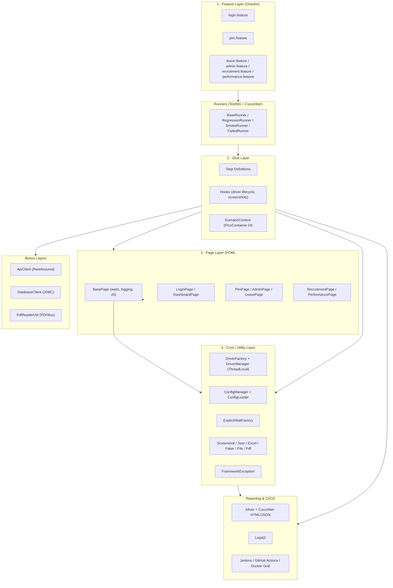
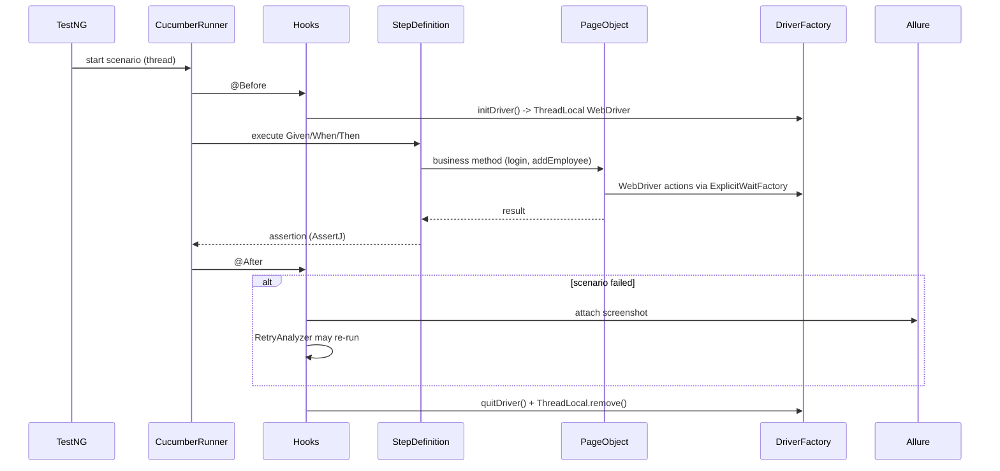

# Framework Architecture

## Layered design

## Execution flow (single scenario)

## Why these layers

- **Separation of concerns** — locators live only in page objects, orchestration
  only in steps, infrastructure only in core. A UI change touches one page object.
- **Parallel-safe by construction** — the driver is `ThreadLocal` and cross-step
  state flows through an injected `ScenarioContext`, never static fields.
- **Config-driven** — browser, environment, timeouts, grid URL and retry count are
  all externalised, so the same artifact runs locally and in CI without edits.
